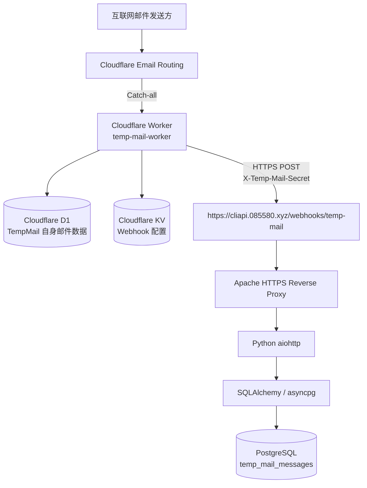

# tgmag

<!-- markdownlint-disable MD013 -->

面向自有或已授权 Telegram 账号的多账号管理 Bot，基于 **aiogram、Telethon、PostgreSQL 和 aiohttp**。

> [!IMPORTANT]
> 本项目仅适用于你本人拥有或已获得明确授权的 Telegram 账号。生产环境推荐使用 **Debian 12 + PostgreSQL + systemd** 部署。

完整的首次生产部署（包括创建独立用户、PostgreSQL 数据库、目录权限和 HTTPS）请按 [DEPLOY.md](DEPLOY.md) 操作；下面的快速开始主要用于本地或前台验证。

## 目录

- [运行要求](#运行要求)
- [快速开始](#快速开始)
- [环境变量](#环境变量)
- [TempMail / Cloudflare Temp Email 部署](#tempmail--cloudflare-temp-email-部署backend-only)
- [生产环境稳定运行](#生产环境稳定运行)
- [VPS 重启后自动启动](#vps-重启后自动启动)
- [更新代码并快速重启](#更新代码并快速重启)
- [常用运维命令](#常用运维命令)
- [常见问题](#常见问题)

## 运行要求

- Debian 12（推荐）
- Python 3.11+
- PostgreSQL 14+
- Telegram Bot Token
- Telegram API ID 与 API Hash
- 公网 HTTPS 域名（仅 Mini App 需要）
- Cloudflare Temp Email、Webhook secret 和 catch-all 域名（仅登录邮箱保护需要）

## 快速开始

### 1. 克隆仓库并安装依赖

```bash
git clone https://github.com/openhomek/tgmag.git
cd tgmag
./ops/install_debian12.sh
cp .env.example .env
```

安装脚本会安装所需系统依赖、创建 `.venv` 虚拟环境，并安装 Python 依赖。

### 2. 配置环境变量

编辑 `.env`：

```bash
nano .env
```

至少填写以下必需配置：

```env
BOT_TOKEN=<YOUR_BOT_TOKEN>
TG_API_ID=<YOUR_TELEGRAM_API_ID>
TG_API_HASH=<YOUR_TELEGRAM_API_HASH>
ADMIN_IDS=<YOUR_TELEGRAM_USER_ID>
DATABASE_URL=postgresql+asyncpg://<DB_USER>:<DB_PASSWORD>@127.0.0.1:5432/<DB_NAME>
FERNET_KEY=<YOUR_FERNET_KEY>
```

### 3. 生成 Fernet 密钥

```bash
.venv/bin/python -c \
'from cryptography.fernet import Fernet; print(Fernet.generate_key().decode())'
```

把完整输出写入 `.env` 的 `FERNET_KEY`。

> [!WARNING]
> Bot 已保存数据后不要直接更换 `FERNET_KEY`，否则已有手机号、Session、2FA 和登录邮箱等加密数据可能无法解密。迁移服务器时必须安全迁移原密钥。

### 4. 初始化数据库

```bash
. .venv/bin/activate
alembic upgrade head
```

### 5. 前台测试运行

```bash
python -m app.main
```

确认 Bot 能正常启动并开始 polling 后，按 `Ctrl+C` 停止，再按下文配置 systemd。

## 环境变量

### 必需配置

| 环境变量 | 必需 | 说明 |
| --- | :---: | --- |
| `BOT_TOKEN` | 是 | 从 `@BotFather` 获取的 Telegram Bot Token。 |
| `ADMIN_IDS` | 是 | Bot 管理员的 Telegram 数值用户 ID；多个 ID 使用英文逗号分隔。 |
| `DATABASE_URL` | 是 | PostgreSQL 的 SQLAlchemy asyncpg 连接串。 |
| `FERNET_KEY` | 是 | 用于加密手机号、Session、2FA 和登录邮箱等敏感数据的主密钥。 |

### 登录邮箱保护

登录邮箱保护默认开启。启用时需要配置以下变量：

| 环境变量 | 必需条件 | 说明 |
| --- | :---: | --- |
| `LOGIN_EMAIL_PROTECTION_ENABLED` | 否 | 是否启用自动登录邮箱保护，默认 `true`；不使用时设为 `false`。 |
| `LOGIN_EMAIL_ALIAS_DOMAINS` | 启用邮箱保护时 | catch-all 域名列表；多个域名使用英文逗号分隔，第一个为初始默认域名。 |
| `TEMP_MAIL_WEBHOOK_SECRET` | 启用邮箱保护时 | Cloudflare Temp Email 调用 Webhook 时使用的随机共享密钥。 |
| `LOGIN_EMAIL_POLL_TIMEOUT_SECONDS` | 否 | 等待 catch-all 转发验证码的时间，默认 `300` 秒（5 分钟）；等待期间不会重复请求验证码。 |

示例：

```env
LOGIN_EMAIL_PROTECTION_ENABLED=true
LOGIN_EMAIL_ALIAS_DOMAINS=mail-a.example.com,mail-b.example.net
TEMP_MAIL_WEBHOOK_SECRET=<YOUR_RANDOM_SECRET>
LOGIN_EMAIL_POLL_TIMEOUT_SECONDS=300
```

每个 TG 账号都可以在 Mini App 的“登录邮箱保护”中单独填写等待时长，单位为整数小时，允许 `0–720`。默认值为 `0`，即收到有效的 777000 登录提醒后立即换绑；大于 `0` 时，在固定窗口内只转发并累计提醒，到期换绑一次。修改只影响之后的新窗口，不改变已经开始的窗口。

不使用登录邮箱保护时：

```env
LOGIN_EMAIL_PROTECTION_ENABLED=false
```

### Mini App

| 环境变量 | 必需条件 | 说明 |
| --- | :---: | --- |
| `MINI_APP_ENABLED` | 否 | 是否启用 Mini App，默认 `false`。 |
| `MINI_APP_PUBLIC_URL` | 启用 Mini App 时 | Telegram 客户端可访问的完整 HTTPS `/mini-app` 地址。 |
| `MINI_APP_HOST` | 否 | Mini App 监听地址，推荐 `127.0.0.1`。 |
| `MINI_APP_PORT` | 否 | Mini App 监听端口，默认 `8080`。 |

> [!CAUTION]
> `.env`、Bot Token、API Hash、数据库密码、Fernet 密钥、Telegram Session 和 Webhook secret 都属于敏感信息，不要提交到 GitHub。

## TempMail / Cloudflare Temp Email 部署（Backend-only）

本节记录当前已经完成真实邮件端到端验证的部署方式。目标是让多个自定义域名下的任意收件地址通过同一个 Cloudflare Worker 收信，再由 Worker 主动把邮件 POST 到 VPS，最后保存到 PostgreSQL。这里的 Cloudflare Temp Email 是上游项目 [dreamhunter2333/cloudflare_temp_email](https://github.com/dreamhunter2333/cloudflare_temp_email)。

> [!IMPORTANT]
> 当前方案有意不部署 Cloudflare Pages，也不运行浏览器邮箱前端。VPS 不会定时查询 Cloudflare Worker；每封新邮件都由 Worker 主动调用 VPS Webhook。

### 1. 已验证架构



各组件职责必须区分清楚：

- **Cloudflare Email Routing** 真正接收发往域名的互联网邮件。
- **Catch-all** 把域名下任意 local-part 的邮件交给 `temp-mail-worker`，无需预先创建邮箱。
- **Cloudflare Temp Email 后端 Worker** 解析邮件，并使用 D1 保存自己的邮件数据。
- **Cloudflare KV** 保存全局 Webhook 配置；Webhook 功能同时依赖 KV 和 `ENABLE_WEBHOOK=true`。
- **VPS Webhook 接收服务** 接受 Worker 主动发来的 HTTPS POST，校验共享 secret 后快速返回 HTTP 200。
- **PostgreSQL 邮件存储** 使用 `temp_mail_messages` 表保存 VPS 侧副本，供登录邮箱保护及其他 VPS 程序查询。
- VPS 根据 Webhook JSON 的 `to` 字段解析完整收件地址和域名，不轮询 Worker，也不依赖 Webhook 的 `url` 字段。

### 2. 当前部署信息

| 项目 | 当前值 |
| --- | --- |
| Worker 名称 | `temp-mail-worker` |
| Worker URL | `https://temp-mail-worker.hey-04138714.workers.dev` |
| 已验证上游版本 | `v1.10.0` |
| 上游项目 | `dreamhunter2333/cloudflare_temp_email` |
| D1 数据库名称 | `temp-mail` |
| D1 Worker Binding | `DB`（必须大写） |
| KV Namespace | `temp-mail-kv` |
| KV Worker Binding | `KV`（必须大写） |
| VPS Webhook | `https://cliapi.085580.xyz/webhooks/temp-mail` |
| VPS 邮件表 | `temp_mail_messages` |

当前接收以下 5 个域名下的任意地址：

```text
mail.085580.xyz
yheblog.dpdns.org
maaqidahusymuni.eu.org
yhewall.dpdns.org
yhedesk.dpdns.org
```

`085580.xyz` 是托管在 Cloudflare 的主 Zone，实际 TempMail 收件域是子域 `mail.085580.xyz`。必须针对这个子域单独启用 Email Routing；父域启用不代表子域自动可收信。

### 3. 准备条件

开始前需要：

- Cloudflare 账号；
- DNS 已托管到 Cloudflare 的域名；
- 可用的 Cloudflare Email Routing；
- Node.js、npm 和 Wrangler；
- 可访问 GitHub 的网络；
- 已部署本项目、PostgreSQL 和 HTTPS Apache 的 VPS。

Windows CMD 可先检查本地工具：

```cmd
node --version
npm --version
npx wrangler --version
```

VPS 本项目的首次部署、PostgreSQL 创建、systemd 和 HTTPS 证书配置请先完成 [DEPLOY.md](DEPLOY.md)。

### 4. 创建并初始化 D1

在 Cloudflare Dashboard 进入：

```text
Storage & Databases
→ D1 SQL Database
→ Create Database
```

创建数据库：

```text
temp-mail
```

然后进入 `temp-mail → Console`，从与 Worker 相同版本的上游代码取得 [`db/schema.sql`](https://github.com/dreamhunter2333/cloudflare_temp_email/blob/v1.10.0/db/schema.sql)，完整执行其中 SQL。初始化成功后再继续部署 Worker。

> [!WARNING]
> `schema.sql` 用于首次初始化。升级已有实例时不要无脑重新初始化 D1；应先阅读目标版本的 [Release](https://github.com/dreamhunter2333/cloudflare_temp_email/releases) 和 [CHANGELOG](https://github.com/dreamhunter2333/cloudflare_temp_email/blob/main/CHANGELOG.md)，确认 Breaking Changes 及对应 migration SQL。

### 5. 创建空 Worker

进入：

```text
Cloudflare
→ Compute (Workers)
→ Workers & Pages
→ Create
→ Worker
```

Worker 名称填写：

```text
temp-mail-worker
```

先完成空 Worker 创建，后续使用 Wrangler 上传正式 `worker.js`。

### 6. `nodejs_compat` 特别说明

该项目需要基础 Compatibility Flag：

```text
nodejs_compat
```

以下 Flag 不能单独代替它：

```text
nodejs_compat_v2
add_nodejs_compat_eol
remove_nodejs_compat_eol
```

本次部署时，新版 Cloudflare Dashboard 的 Compatibility flags 下拉框没有正常提供基础 `nodejs_compat`，因此采用 Wrangler 部署。先登录：

```cmd
npx wrangler login
```

浏览器完成 Cloudflare 授权后再继续。

### 7. 下载 `worker.js`

Windows CMD：

```cmd
curl.exe -L https://github.com/dreamhunter2333/cloudflare_temp_email/releases/latest/download/worker.js -o worker.js
dir worker.js
```

`latest` 当前指向本次验证的 `v1.10.0`；以后它可能变化。若要严格复刻当前实例，应把 URL 中的 `latest/download` 改为 `download/v1.10.0`，并同时使用该版本的 D1 schema/migration。

### 8. 使用 Wrangler 部署 Worker

本次已验证成功的命令：

```cmd
npx wrangler deploy worker.js --name temp-mail-worker --compatibility-date 2026-06-16 --compatibility-flag nodejs_compat
```

成功时应看到类似输出：

```text
Uploaded temp-mail-worker
Deployed temp-mail-worker triggers
https://temp-mail-worker.<account>.workers.dev
```

- `2026-06-16` 是本次成功部署使用的 Compatibility date。
- 以后部署新版本时，可按当时 Cloudflare 要求更新 date。
- `--compatibility-flag nodejs_compat` 不能遗漏。
- 记录部署输出中的 Worker URL；当前实例是 `https://temp-mail-worker.hey-04138714.workers.dev`。

### 9. 配置 Worker Variables 和 Secret

进入：

```text
temp-mail-worker
→ Settings
→ Variables and Secrets
```

配置 `DOMAINS`，类型为 **JSON**：

```json
[
  "mail.085580.xyz",
  "yheblog.dpdns.org",
  "maaqidahusymuni.eu.org",
  "yhewall.dpdns.org",
  "yhedesk.dpdns.org"
]
```

配置 `JWT_SECRET`，类型为 **Secret**。可以在 Windows CMD 生成 32 字节随机值：

```cmd
node -e "console.log(require('crypto').randomBytes(32).toString('hex'))"
```

只把输出保存到 Cloudflare Secret，README、Issue 和 Git 中一律使用 `<YOUR_JWT_SECRET>` 占位符。

再配置：

| 变量 | 类型 | 当前值 | 作用 |
| --- | --- | --- | --- |
| `ENABLE_USER_CREATE_EMAIL` | JSON | `true` | 当前实例允许创建地址 |
| `ENABLE_WEBHOOK` | JSON | `true` | 启用当前架构必需的邮件 Webhook |

当前是 Backend-only 部署，没有配置 `FRONTEND_URL`。

### 10. 绑定 D1

进入：

```text
temp-mail-worker
→ Settings
→ Bindings
→ Add Binding
→ D1 Database
```

填写：

```text
Binding name: DB
Database: temp-mail
```

> [!IMPORTANT]
> Binding 名称必须是大写 `DB`，不能写成 `db`、`DATABASE` 或 `D1`。

### 11. 验证 Worker 基础 API

浏览器访问：

```text
https://temp-mail-worker.hey-04138714.workers.dev/open_api/settings
```

应该返回 JSON，重点确认：

```json
{
  "enableUserCreateEmail": true,
  "enableWebhook": true,
  "domains": [
    "mail.085580.xyz",
    "yheblog.dpdns.org",
    "maaqidahusymuni.eu.org",
    "yhewall.dpdns.org",
    "yhedesk.dpdns.org"
  ]
}
```

实际响应还会包含其他字段。若该接口不能正常返回 JSON，先检查 Worker、D1 Binding 和 Variables，不要继续配置邮件链路。

### 12. 配置 Cloudflare Email Routing

Worker 能访问不等于邮箱能收信。以下 5 个收件域都必须启用 Email Routing，并拥有正确的邮件 DNS records：

```text
mail.085580.xyz
yheblog.dpdns.org
maaqidahusymuni.eu.org
yhewall.dpdns.org
yhedesk.dpdns.org
```

针对每个域名进入 `Cloudflare → Email Routing`，确认：

```text
Email Routing = Enabled
邮件 DNS records = 正常
Routing rules
→ Catch-all address
→ Send to a Worker
→ temp-mail-worker
→ Active
```

完成后的效果是任意 local-part 都交给同一个 Worker，例如：

```text
abc@yheblog.dpdns.org
test123@yheblog.dpdns.org
random123@mail.085580.xyz
whatever@yhedesk.dpdns.org
```

这些地址都不需要预先创建。

### 13. `mail.085580.xyz` 子域特别配置

> [!IMPORTANT]
> 主 Zone 是 `085580.xyz`，真正的收件域是 `mail.085580.xyz`。Cloudflare Email Routing 子域不会自动继承父域配置。

进入：

```text
Email Routing
→ Settings
→ Subdomains
```

添加 `mail.085580.xyz` 并确认状态为 `Enabled`，然后针对该子域配置：

```text
Catch-all
→ Send to Worker
→ temp-mail-worker
→ Active
```

### 14. 创建并绑定 KV

进入：

```text
Cloudflare
→ Storage & Databases
→ KV
→ Create Namespace
```

创建：

```text
temp-mail-kv
```

然后进入 Worker：

```text
temp-mail-worker
→ Settings
→ Bindings
→ Add Binding
→ KV Namespace
```

填写：

```text
Binding name: KV
Namespace: temp-mail-kv
```

> [!IMPORTANT]
> KV Binding 名称必须是大写 `KV`。Webhook 触发同时依赖 `KV` Binding 和 `ENABLE_WEBHOOK=true`。

### 15. VPS Webhook 接收服务

当前公网接口：

```text
https://cliapi.085580.xyz/webhooks/temp-mail
```

当前技术栈和数据流：

```text
Apache HTTPS Reverse Proxy
→ Python aiohttp（127.0.0.1:8080）
→ SQLAlchemy / asyncpg
→ PostgreSQL.temp_mail_messages
```

当前 VPS 的 secret 文件是 `/root/tgmag/vps_gpt/.env`；不同安装目录应使用对应项目根目录的 `.env`。只能写入占位值：

```env
MINI_APP_ENABLED=true
MINI_APP_HOST=127.0.0.1
MINI_APP_PORT=8080
LOGIN_EMAIL_PROTECTION_ENABLED=true
LOGIN_EMAIL_ALIAS_DOMAINS=mail.085580.xyz,yheblog.dpdns.org,maaqidahusymuni.eu.org,yhewall.dpdns.org,yhedesk.dpdns.org
TEMP_MAIL_WEBHOOK_SECRET=<YOUR_RANDOM_SECRET>
```

`TEMP_MAIL_WEBHOOK_SECRET` 至少需要 32 个非空白字符。可在 VPS 生成：

```bash
openssl rand -hex 32
```

把输出只写入 `.env`，不要把真实值放进 README、Shell 历史、Issue 或 Git。修改后执行：

```bash
.venv/bin/alembic upgrade head
sudo systemctl restart tg-account-bot
```

迁移 `0009_temp_mail_messages` 会创建 VPS 的 `temp_mail_messages` 表。当前 aiohttp 服务与 Mini App 共用启动开关，因此 `MINI_APP_ENABLED=true` 是 Webhook 监听 `127.0.0.1:8080` 的必要条件。

在现有 `cliapi.085580.xyz` HTTPS VirtualHost 中复用 Apache 证书并添加：

```apache
ProxyPreserveHost On
RequestHeader set X-Forwarded-Proto "https"
RequestHeader set X-Forwarded-Host "cliapi.085580.xyz"

ProxyPass /webhooks/temp-mail http://127.0.0.1:8080/webhooks/temp-mail
ProxyPassReverse /webhooks/temp-mail http://127.0.0.1:8080/webhooks/temp-mail
```

确保模块已启用，然后验证并平滑加载：

```bash
sudo a2enmod proxy proxy_http headers ssl
sudo apache2ctl configtest
sudo systemctl reload apache2
```

不要把 8080 直接暴露到公网。完整 HTTPS 证书和 VirtualHost 部署仍以 [DEPLOY.md](DEPLOY.md) 为准。

### 16. Webhook 请求与 PostgreSQL 数据格式

Worker 调用格式：

```http
POST /webhooks/temp-mail HTTP/1.1
Content-Type: application/json
X-Temp-Mail-Secret: <YOUR_RANDOM_SECRET>
```

支持的 JSON 字段：

```json
{
  "id": "",
  "url": "",
  "from": "",
  "to": "",
  "subject": "",
  "raw": "",
  "parsedText": "",
  "parsedHtml": "",
  "aiExtractType": "",
  "aiExtractResult": "",
  "aiExtractResultText": ""
}
```

VPS 从 `to` 提取完整地址和域名。例如 `abc@yheblog.dpdns.org` 会解析为：

```text
address = abc@yheblog.dpdns.org
domain = yheblog.dpdns.org
```

`temp_mail_messages` 保存 `id`、`from`、`to`、`domain`、`subject`、`raw`、`parsedText`、`parsedHtml`、AI 提取字段、`url` 和 `received_at`。`(id, to)` 是复合主键，同一 Webhook 重试不会产生重复记录；`to + received_at` 和 `domain + received_at` 均有索引，可按完整地址查询全部邮件或最新一封。

当前 aiohttp 请求上限是 **5 MiB**。包含大附件或超长 `raw`、导致 JSON 超过该限制的请求会返回 HTTP 413；附件型大邮件需要在业务上避免进入该验证码 Webhook，或在评估内存和安全影响后另行调整代码限制。

### 17. 配置全局邮件 Webhook

当前是 Backend-only 部署，可直接进入：

```text
Cloudflare
→ KV
→ temp-mail-kv
→ KV Pairs
```

创建 Key：

```text
temp-mail-webhook-admin-mail-settings
```

Value 使用以下 JSON 模板。只在 Cloudflare KV 中把 `<TEMP_MAIL_WEBHOOK_SECRET>` 替换为 VPS `.env` 内 `TEMP_MAIL_WEBHOOK_SECRET` 的真实值；不要把替换后的 JSON 提交到 Git：

```json
{
  "enabled": true,
  "url": "https://cliapi.085580.xyz/webhooks/temp-mail",
  "method": "POST",
  "headers": "{\"Content-Type\":\"application/json\",\"X-Temp-Mail-Secret\":\"<TEMP_MAIL_WEBHOOK_SECRET>\"}",
  "body": "{\"id\":\"${id}\",\"url\":\"${url}\",\"from\":\"${from}\",\"to\":\"${to}\",\"subject\":\"${subject}\",\"raw\":\"${raw}\",\"parsedText\":\"${parsedText}\",\"parsedHtml\":\"${parsedHtml}\",\"aiExtractType\":\"${aiExtractType}\",\"aiExtractResult\":\"${aiExtractResult}\",\"aiExtractResultText\":\"${aiExtractResultText}\"}"
}
```

这是 **Admin Mail Webhook**，会处理所有域名的邮件。无需为 5 个域名分别创建 5 个 Webhook；所有邮件都发到同一个 URL，由 VPS 根据 `to` 和 `domain` 分类。

### 18. 为什么不部署前端 Pages

当前部署有意不使用 Cloudflare Pages：

```text
不需要 frontend.zip
不需要 Pages
不需要浏览器邮箱 UI
```

这是一个 **Backend-only TempMail** 架构。

目标链路只有：

```text
Cloudflare 收信
→ Worker
→ VPS Webhook
→ PostgreSQL
→ VPS 上其他程序消费邮件
```

因为没有设置 `FRONTEND_URL`，Webhook JSON 中的 `"url": ""` 可能为空，这是正常现象。读取和识别邮件依赖 `id`、`from`、`to`、`subject`、`raw`、`parsedText` 和 `parsedHtml`，不依赖 `url`。

### 19. 直接测试 VPS Webhook

不要在命令或文档中填写生产 secret；本地执行时才替换占位符：

```bash
curl -i \
  -X POST \
  https://cliapi.085580.xyz/webhooks/temp-mail \
  -H 'Content-Type: application/json' \
  -H 'X-Temp-Mail-Secret: <TEMP_MAIL_WEBHOOK_SECRET>' \
  -d '{
    "id":"test-001",
    "from":"sender@example.com",
    "to":"abc@mail.085580.xyz",
    "subject":"Webhook Test",
    "raw":"",
    "parsedText":"Hello TempMail",
    "parsedHtml":"<p>Hello TempMail</p>"
  }'
```

正常应返回 HTTP 200。重复发送相同 `id + to` 仍返回 200，但不会重复插入。

### 20. 真实邮件端到端测试

从 Gmail、Outlook 或其他外部邮箱发送：

```text
To: cfhooktest@yheblog.dpdns.org
Subject: CF-WEBHOOK-TEST-001
```

然后在 VPS PostgreSQL 查询：

```sql
SELECT
    id,
    "from",
    "to",
    domain,
    subject,
    received_at
FROM temp_mail_messages
WHERE "to" = 'cfhooktest@yheblog.dpdns.org'
ORDER BY received_at DESC
LIMIT 10;
```

成功标准：

```text
Cloudflare 成功接收邮件
→ Catch-all 成功触发 Worker
→ Worker POST Webhook
→ VPS 返回 HTTP 200
→ PostgreSQL 出现对应邮件
```

### 21. 多域名工作方式

不需要一个域名一个 Worker、一个域名一个 Webhook，也不需要一个域名一张 PostgreSQL 表：

```text
5 个域名
    |
    v
同一个 temp-mail-worker
    |
    v
同一个 /webhooks/temp-mail
    |
    v
同一个 temp_mail_messages
```

VPS 使用 `to` 和 `domain` 区分邮件。当前代码只接受本节列出的 5 个域名；新增域名除了配置 Cloudflare，还需要同步更新 VPS 允许列表和 `LOGIN_EMAIL_ALIAS_DOMAINS`。

### 22. 常见故障排查

| 现象 | 重点检查 | 处理方式 |
| --- | --- | --- |
| Worker 报 `No such module "path"` 或 `No such module "node:stream"` | `nodejs_compat` 是否真正启用 | 使用 Wrangler 的 `--compatibility-flag nodejs_compat`；不要用 `nodejs_compat_v2`、`add_nodejs_compat_eol` 等替代基础 Flag |
| `/open_api/settings` 报错 | D1 Binding 名称 | 必须是大写 `DB`，不能是 `db`、`DATABASE` 或 `D1` |
| Webhook 完全不触发 | Worker Variables、KV Binding、KV Pair | 确认 `ENABLE_WEBHOOK=true`、Binding 为大写 `KV`，且存在 `temp-mail-webhook-admin-mail-settings` |
| Webhook 返回 401 | 请求头 secret | 核对 `X-Temp-Mail-Secret` 与 VPS `TEMP_MAIL_WEBHOOK_SECRET` 完全一致 |
| Webhook 返回 403 | Cloudflare/Apache 的访问控制 | 检查 Cloudflare WAF、访问规则和 Apache 限制；VPS 应用自身对错误 secret 返回 401 |
| Webhook 返回 413 | JSON 超过 5 MiB | 检查 `raw` 和附件导致的体积；当前服务明确限制请求大小 |
| Worker 可访问但邮箱收不到信 | Email Routing 链路 | 检查 Enabled、邮件 DNS records、Catch-all Active，以及是否 Send to `temp-mail-worker` |
| 主域能收但 `mail.085580.xyz` 不能收 | 子域 Email Routing | 在 `Email Routing → Settings → Subdomains` 单独启用 `mail.085580.xyz` 并配置 Catch-all |
| Webhook `url` 为空 | 未部署 Pages、未设置 `FRONTEND_URL` | 当前 Backend-only 架构下属于正常现象，不能据此判断失败 |
| VPS 收到并保存邮件，但 Telegram 换绑失败 | Telegram 域名策略或限流 | 查看 Bot 通知和 `journalctl`；`EMAIL_NOT_ALLOWED`、`FLOOD_WAIT` 不代表 Webhook 故障 |
| VPS 完全没有请求日志 | Worker 尚未 POST | 区分“Email Routing 收信成功”和“Webhook 投递成功”，检查 Worker/KV 配置和 Worker 日志 |

VPS 排障命令：

```bash
sudo systemctl status tg-account-bot apache2 postgresql --no-pager
sudo journalctl -u tg-account-bot -n 200 --no-pager
sudo tail -n 200 /var/log/apache2/tg-account-bot-mini-app-access.log
sudo apache2ctl configtest
```

### 23. 安全注意事项

> [!CAUTION]
> 禁止把 `JWT_SECRET`、`TEMP_MAIL_WEBHOOK_SECRET`、Cloudflare API Token、数据库密码、Bot Token、Fernet 密钥或 Telegram Session 提交到仓库。

- `.env` 必须保持在 `.gitignore`；当前 secret 位于 `/root/tgmag/vps_gpt/.env`，但 README 只能出现变量名或占位符。
- 不要执行 `cat .env` 后把整份内容复制到 README、Issue、聊天记录、Git commit 或公开日志。
- VPS 使用 `X-Temp-Mail-Secret` 校验 Worker，请求头和 secret 不得写入应用日志或 Apache 自定义日志格式。
- 排查 Cloudflare Worker 时不要粘贴 KV Value 或完整 headers；如果 secret 疑似暴露，应同时更新 VPS `.env` 和 KV Webhook headers，然后重启服务并重新测试。
- 生成 secret 时使用系统安全随机源，至少 32 个非空白字符，不要复用 JWT、数据库或 Bot 凭据。

### 24. 升级 Cloudflare Temp Email

升级前：

1. 记录当前 Worker 版本和配置；
2. 查看上游 Release；
3. 阅读 CHANGELOG，特别检查 Breaking Changes；
4. 检查是否需要执行新的 D1 migration；
5. 备份重要 D1 数据、KV Webhook 配置和 Worker Variables/Secrets；
6. 不要在备份或工单中暴露真实 secret。

重新下载最新版：

```cmd
curl.exe -L https://github.com/dreamhunter2333/cloudflare_temp_email/releases/latest/download/worker.js -o worker.js
```

重新部署：

```cmd
npx wrangler deploy worker.js --name temp-mail-worker --compatibility-date <CURRENT_DATE> --compatibility-flag nodejs_compat
```

升级 Worker 时不要删除或重建现有的 D1、KV、Email Routing、Catch-all、Variables 和 Secrets。升级后重新访问 `/open_api/settings`，再发送一封真实测试邮件确认完整链路。

### 25. 最终部署检查清单

- [ ] 域名 DNS 已托管 Cloudflare
- [ ] D1 `temp-mail` 已创建
- [ ] 与 Worker 版本匹配的 `schema.sql` 已执行
- [ ] Worker `temp-mail-worker` 已部署
- [ ] `nodejs_compat` 已启用
- [ ] `DOMAINS` 已配置全部 5 个域名
- [ ] `JWT_SECRET` 已作为 Secret 配置
- [ ] `ENABLE_USER_CREATE_EMAIL=true`
- [ ] D1 Binding 名称为大写 `DB`
- [ ] `/open_api/settings` 返回正常 JSON
- [ ] 5 个域名的 Email Routing 均正常
- [ ] `mail.085580.xyz` 子域 Email Routing 已单独启用
- [ ] 所有域名 Catch-all 均指向 `temp-mail-worker`
- [ ] KV `temp-mail-kv` 已创建
- [ ] KV Binding 名称为大写 `KV`
- [ ] `ENABLE_WEBHOOK=true`
- [ ] `temp-mail-webhook-admin-mail-settings` 已配置且 `enabled=true`
- [ ] VPS `.env` 已配置 `TEMP_MAIL_WEBHOOK_SECRET`
- [ ] VPS 已执行 `alembic upgrade head`
- [ ] VPS aiohttp 仅监听 `127.0.0.1:8080`
- [ ] Apache 已代理 `/webhooks/temp-mail`
- [ ] VPS Webhook HTTPS 地址可访问
- [ ] `X-Temp-Mail-Secret` 验证正常
- [ ] curl 模拟 Webhook 返回 HTTP 200
- [ ] 真实外部邮件可以进入 PostgreSQL
- [ ] `temp_mail_messages` 可以按完整 `to` 查询邮件

## 生产环境稳定运行

仓库内已经提供 systemd 服务文件：

```text
ops/systemd/tg-account-bot.service
```

默认配置使用：

| 项目 | 默认值 |
| --- | --- |
| 部署目录 | `/opt/tg-account-bot` |
| 服务用户 | `tg-account-bot` |
| systemd 服务名 | `tg-account-bot` |
| 环境变量文件 | `/opt/tg-account-bot/.env` |
| 启动命令 | `/opt/tg-account-bot/.venv/bin/python -m app.main` |

> [!IMPORTANT]
> 下方 systemd 命令不是“快速开始”的直接下一步。执行前必须先完成 [DEPLOY.md 第 2～6 节](DEPLOY.md#2-安装系统依赖和代码)：创建 `tg-account-bot` 用户，将代码部署到 `/opt/tg-account-bot`，配置权限和 `.env`，安装依赖并执行数据库迁移。否则 `/opt/tg-account-bot` 或服务用户不存在，命令会失败。

安装 systemd 服务：

```bash
cd /opt/tg-account-bot
sudo install -m 644 ops/systemd/tg-account-bot.service \
  /etc/systemd/system/tg-account-bot.service
sudo systemctl daemon-reload
sudo systemctl enable --now tg-account-bot
```

`enable --now` 会同时完成两件事：

1. 立即启动 Bot；
2. 设置 VPS 重启后自动启动 Bot。

服务文件还配置了 `Restart=always`，Bot 进程异常退出后，systemd 会自动尝试重新启动。

## VPS 重启后自动启动

只需执行一次：

```bash
sudo systemctl enable --now tg-account-bot
```

确认开机自启已经启用：

```bash
sudo systemctl is-enabled tg-account-bot
```

正常应输出：`enabled`

确认当前服务正在运行：

```bash
sudo systemctl is-active tg-account-bot
```

正常应输出：`active`

查看完整状态：

```bash
sudo systemctl status tg-account-bot --no-pager
```

建议配置完成后主动重启一次 VPS 进行验证：

```bash
sudo reboot
```

重新连接服务器后检查：

```bash
sudo systemctl status tg-account-bot --no-pager
```

## 更新代码并快速重启

### 推荐：完整安全更新

代码、依赖或数据库迁移可能发生变化时，使用下面这组命令：

```bash
cd /opt/tg-account-bot && \
sudo -u tg-account-bot git pull --ff-only && \
sudo -u tg-account-bot .venv/bin/python -m pip install -r requirements.txt && \
sudo -u tg-account-bot .venv/bin/alembic upgrade head && \
sudo systemctl restart tg-account-bot && \
sudo systemctl status tg-account-bot --no-pager
```

这组命令会依次完成：

1. 拉取 GitHub 最新代码；
2. 同步 Python 依赖；
3. 执行数据库迁移；
4. 重启 Bot；
5. 检查服务状态。

### 快速：仅更新普通代码

确认本次更新没有修改 `requirements.txt`，也没有新增数据库迁移时，可以使用：

```bash
cd /opt/tg-account-bot && \
sudo -u tg-account-bot git pull --ff-only && \
sudo systemctl restart tg-account-bot && \
sudo systemctl status tg-account-bot --no-pager
```

### 只修改了 `.env`

保存 `.env` 后重启服务即可：

```bash
sudo systemctl restart tg-account-bot
sudo systemctl status tg-account-bot --no-pager
```

### 实时查看启动日志

```bash
sudo journalctl -u tg-account-bot -f
```

按 `Ctrl+C` 退出日志查看，不会停止 Bot。

> [!NOTE]
> `git pull --ff-only` 会在服务器代码存在冲突或本地提交时停止，而不会自动覆盖修改，适合生产服务器使用。生产环境不建议直接手工修改仓库内的代码。

## 常用运维命令

| 操作 | 命令 |
| --- | --- |
| 启动 Bot | `sudo systemctl start tg-account-bot` |
| 停止 Bot | `sudo systemctl stop tg-account-bot` |
| 重启 Bot | `sudo systemctl restart tg-account-bot` |
| 查看状态 | `sudo systemctl status tg-account-bot --no-pager` |
| 查看最近 100 行日志 | `sudo journalctl -u tg-account-bot -n 100 --no-pager` |
| 实时查看日志 | `sudo journalctl -u tg-account-bot -f` |
| 启用开机自启 | `sudo systemctl enable tg-account-bot` |
| 关闭开机自启 | `sudo systemctl disable tg-account-bot` |
| 查看是否开机自启 | `sudo systemctl is-enabled tg-account-bot` |
| 查看当前是否运行 | `sudo systemctl is-active tg-account-bot` |

## 常见问题

### 服务启动后立即退出

查看详细日志：

```bash
sudo journalctl -u tg-account-bot -n 200 --no-pager
```

常见原因：

- `.env` 缺少必需变量或变量格式错误；
- PostgreSQL 没有启动或 `DATABASE_URL` 不正确；
- 尚未执行数据库迁移；
- 项目目录、`.env` 或 `data/` 权限不正确；
- 同一个 Bot Token 正在被另一个实例使用，产生 polling 冲突。

### 数据库迁移未完成

```bash
cd /opt/tg-account-bot
sudo -u tg-account-bot .venv/bin/alembic upgrade head
sudo systemctl restart tg-account-bot
```

### 拉取代码时提示本地修改冲突

先查看服务器上被修改的文件：

```bash
cd /opt/tg-account-bot
git status
```

不要直接执行 `git reset --hard`，除非你确认服务器上的本地修改全部可以丢弃。

### 修改了 systemd 服务文件但没有生效

重新安装服务文件并加载配置：

```bash
cd /opt/tg-account-bot
sudo install -m 644 ops/systemd/tg-account-bot.service \
  /etc/systemd/system/tg-account-bot.service
sudo systemctl daemon-reload
sudo systemctl restart tg-account-bot
```

## License

[MIT](LICENSE)
